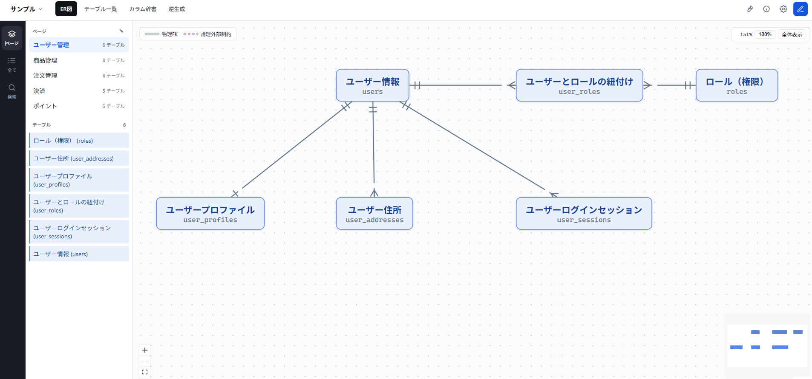
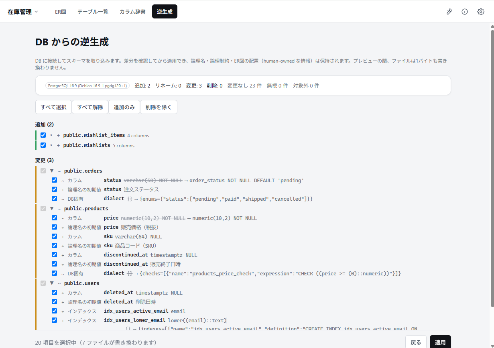
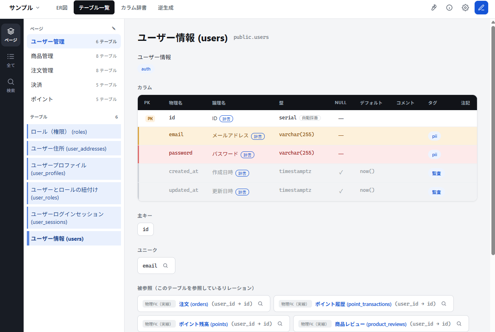
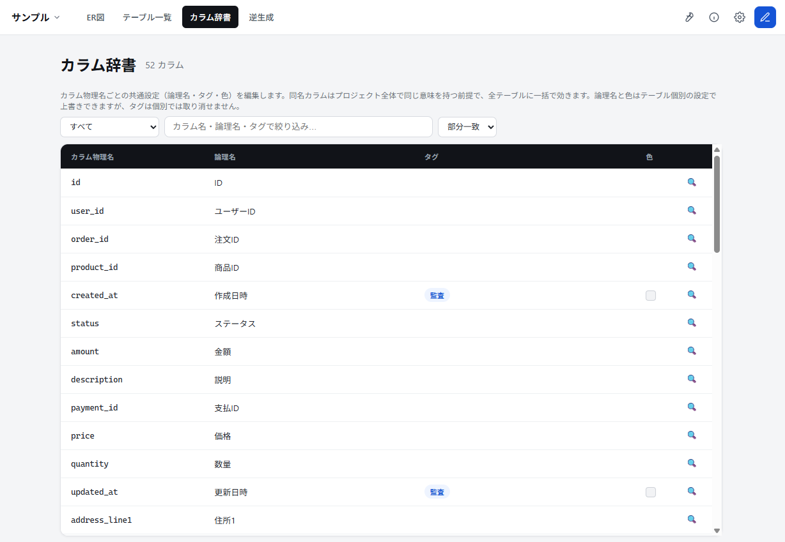

# ERForge
**ER 図とテーブル定義書を、DB と Git に合わせて育てるツールです。**

ERForge は、DB からスキーマを取り込み、ER 図・テーブル定義書・論理名・注記をひとつの成果物として管理します。
DB が変わっても差分を見ながら更新でき、人が書いた説明は消えません。

| よくある課題 | ERForge なら |
|---|---|
| **定義書がすぐ古くなる**。DB は変わっているのに、資料だけ昔のままになりがち | DB から最新のテーブル情報を取り込める。変更点を確認してから反映できるので、定義書を無理なく更新できる |
| **ER 図と定義書が別々で管理しづらい**。どちらが正しいのか分からなくなる | ER 図、テーブル一覧、カラム詳細を同じデータから表示する。片方だけ直し忘れて内容がずれる、という状態を減らせる |
| **業務上の説明を書き足すと、次の更新で消えてしまう** | 論理名、注記、タグなど人が書いた情報は残したまま、DB から取り込んだ情報だけ更新できる |
| **見る人に専用ソフトを入れてもらうのが面倒** | 成果物はサーバー不要で動作する HTML ファイル。受け取った人はブラウザで開くだけで ER 図と定義書を確認できる |
| **変更内容をレビューしづらい**。バイナリ資料だと差分が見えない | データはテキストで保存される。Git の差分で変更内容を確認し、コードと同じようにレビューできる |

成果物をリポジトリに置けば、ER 図と定義書もコードと同じワークフローで育てられます。

# 機能

ERForge は、ER 図・テーブル定義書・補足メモをひとつにまとめて管理できます。
DB の変更を取り込みながら、人が書いた論理名や注記は残せるので、ドキュメントを無理なく最新に保てます。

## ER 図作成支援

DB から取り込んだテーブルは、ER 図のノードとして自動で用意されます。
利用者は必要なノードを図に配置するだけで、見やすい ER 図を作れます。

- テーブルごとのノードは生成済みなので、ゼロから箱を作る必要がない
- 物理 FK がある関係は、リレーションとして自動で描画される
- 業務領域ごとにページを分けて、読みやすい図に整理できる



## DB からの定義書更新

実際の DB に接続して、テーブル・カラム・制約・コメントを読み取れます。
変更点は取り込む前に確認できるので、意図しない上書きを避けながらドキュメントを更新できます。

- 追加・削除・変更を差分で確認できる
- テーブル名・カラム名の変更も引き継ぎやすい
- ドキュメント化が不要なテーブルは、次回以降の取り込み対象から除外できる



## ER 図と定義書の一元管理

ER 図、テーブル一覧、カラム詳細はすべて同じデータを見ています。
「ER 図ではこう見えるのに、定義書では違う」といった食い違いを防げます。

- ER 図上からダイアログで詳細情報を確認できる
- ER 図とテーブル詳細との相互リンクにより、必要な情報をすぐ確認できる



## 豊富なドキュメンテーション機能

DB から取得できる物理情報だけでなく、業務上の意味や補足説明も一緒に整理できます。
読む人に合わせて、テーブルやカラムの意味、注意点、分類を分かりやすく残せます。

- テーブルやカラムに論理名を付与
- DB に FK がない関係も、補足情報として図に表現可能
- 補足メモやタグで情報を整理
- カラムの論理名・タグ付けはカラム辞書でまとめて管理
- DB から再取り込みしても、論理名・注記・タグは残したまま更新可能



## Git でレビューしやすい成果物

データはテキストとして保存されるため、変更内容を `git diff` で確認できます。
ER 図や定義書の更新も、コードと同じようにプルリクエストでレビューできます。

- 差分が読みやすいテキスト形式
- 同じ内容なら同じ出力になる、安定したファイル
- チーム開発のワークフローに載せやすい

## ブラウザでそのまま閲覧可能な成果物

閲覧用の成果物は、サーバー不要で動作する HTML / JavaScript ファイルです。
受け取った人はブラウザで開くだけで、専用ツールやサーバーなしで ER 図と定義書を確認できます。

- インストール不要で閲覧可能
- 日本語 / 英語表示に対応
- DB 情報は手元の環境だけで扱える

## 対応 DB

JDBC ドライバがあれば、多くの DB で利用できます。
PostgreSQL / MySQL では DB 固有の情報も取得でき、SQL Server / Oracle / SQLite でも動作を検証しています。

# 開発者向け

## 構成

| ディレクトリ | 内容 |
|---|---|
| `server/` | Java 17 / Gradle。core（モデル・決定論的プリンタ・index 生成・移行）と web（Javalin） |
| `viewer/` | TypeScript / React / Vite。単一の `index.html` に全アセットをインライン化 |
| `fixtures/` | Java / TS 共通の golden fixture。プリンタ出力の一致を保証 |
| `distribution/` | 配布 ZIP に同梱する固定ファイル（起動スクリプト・README） |
| `dev-db/` | 動作確認用の DB（PostgreSQL / MySQL / SQL Server / Oracle の docker compose）と、DB 製品ごとのスキーマ・マイグレーション（→ [README](dev-db/README.md)） |

## 開発環境の起動

リリースビルドを作り直さなくても、**サーバーと HMR 付きビューアをつないだ状態**で開発できます。
**配布物とまったく同じ経路**（Java サーバーが `workspace-*/data/**.js` を配信し、ビューアは `<script>` で読み込みます）
で動くため、dev だけ挙動が違うということがありません。ターミナルを 2 つ使います。

```sh
# 1) Java サーバー（データは dev/ 以下。ブラウザは開かない）
cd server && ./gradlew devServer

# 2) ビューア（vite dev。ブラウザが自動で開く）
cd viewer && npm run dev
```

`http://localhost:5173/?t=erd-dev` が開きます。ソースを保存すればビューアは HMR で即時反映されます。
サーバー側を直したときは、`gradlew devServer` を再起動してください。

| | 内容 |
|---|---|
| プロジェクトディレクトリ | `dev/`（Git 管理外）。配布物での `erd/` にあたる |
| データ | `dev/workspace-<id>/data/`（ワークスペース単位） |
| 初回起動 | ワークスペースが無ければ、作成画面からブートストラップ画面へ進む。**サンプルを取り込めばすぐに試せる** |
| JDBC ドライバ | `dev/drivers/*.jar` に置く（逆生成を試す場合。→ [dev-db/](dev-db/README.md)）。設定は `dev/config.js`（全ワークスペース共通） |
| サーバーのポート | `5321`（使用中なら自動で繰り上がる）。`ERD_PORT` で変更できる |
| トークン | `erd-dev` に固定（`ERD_TOKEN`）。dev の URL を固定するため。配布物では毎回ランダム |

**仕組み**: ビューアはデータを常に `<script src="workspace-<id>/data/**.js">` の相対パスで読み込みます
（読み込み経路はモードによらず 1 本です）。そこで vite dev が `/workspace-*/data/`・
`/workspaces.js`・`/__erd` を Java サーバーへプロキシします。`GET /__erd/health` が通るので
サーバーモードになります。

> vite の `public/` は**使いません**（`publicDir: false`）。`public/` 配下に同名のデータを置くと
> そちらを先に読み込み、**サーバーの実データではなくそちらを見てしまう**ことがあるため、経路を 1 本に固定しています。
> 静的モード（`file://`）の確認では、ビルドした `index.html` を `workspaces.js` と
> `workspace-<id>/data/` の隣に置いて開きます（`npm run e2e` がまさにそれを組み立てています）。

`ERD_PORT` を変えた場合は、ビューア側にも同じ値を渡してください（プロキシ先を合わせるためです）。

```sh
cd server && ERD_PORT=5400 ./gradlew devServer
cd viewer && ERD_PORT=5400 npm run dev
```

PowerShell では `$env:ERD_PORT="5400"` を先に実行してください。

### 動作確認用の DB

逆生成を実際の DB に対して試すための PostgreSQL（docker compose）と、
段階的に適用できるマイグレーション一式を [dev-db/](dev-db/README.md) に用意しています。

コンテナは**空の DB で起動します**。スキーマは初期化（`000_init.sql`）も含めて `migrate.mjs` で投入します。

```sh
cd dev-db && docker compose up -d && npm install
node migrate.mjs up 000     # 初期スキーマを投入します（約 30 テーブル。同梱サンプルの元データです）
node migrate.mjs up 001     # ENUM / CHECK / 部分・式インデックスまで適用します
```

**MySQL**に加え、追加 DB の内省検証として **SQL Server / Oracle**
（いずれも docker compose の profile で分けています）と **SQLite**（docker 不要・プロセス内）も用意しています。
PostgreSQL 以外は**初期スキーマがコンテナの起動時に自動で入ります**。詳細は
[dev-db/README.md](dev-db/README.md) を参照してください。

## ビルド

```sh
# ビューア（viewer/dist/index.html を生成）
cd viewer && npm install && npm run build

# サーバー（server/build/libs/erd-server.jar を生成）
cd server && ./gradlew shadowJar
```

## テスト

```sh
cd viewer && npm run typecheck && npm test && npm run e2e   # e2e はビルド後に file:// でスモークテストを行う
cd server && ./gradlew test
```

## リリース

手順は次のとおりです。

1. リポジトリ直下の **`VERSION`** を更新してコミットする（例 `0.3.0`）
2. **タグを打つ**: `git tag v0.3.0`（**タグと `VERSION` は必ず一致させる**）
3. Windows なら **`build-dist.bat`**、macOS / Linux なら **`./build-dist.sh`** を実行する
   （npm install → viewer ビルド → shadowJar → ZIP 組み立てまで自動。`--no-pause` で自動化にも使える）
4. `server/build/dist/erd.zip` を GitHub Releases に手動アップロードする

手動でビルドする場合は、次を実行してください。

```sh
cd server && ERD_RELEASE=1 ./gradlew packageDist
```

### バージョン

**リポジトリ直下の `VERSION`（1 行）が、バージョンの信頼できる唯一の情報源です**。ビルド時に `index.html`（vite の define）と
`erd-server.jar`（マニフェストの `Implementation-Version`）の両方へ焼き込まれ、画面右上の
**information（ⓘ）** に表示されます。サーバーモードでは jar 側の版も `GET /__erd/health` から取得して
並べ、食い違っていれば注意文を出します（`index.html` だけ差し替えたときに気づけます）。

**リリースビルド（`build-dist.*`）だけが `ERD_RELEASE=1`** を立て、`VERSION` そのままの版になります。
それ以外の手元ビルドは `-dev` が付きます（例 `0.2.0-dev`）。`gradlew devServer` のように jar 化せずに実行する場合は `dev` です。

データ形式の版（`schemaVersion`）とは**独立した軸**であり、連動させません。

JDBC ドライバは配布物に同梱しません。利用者は逆生成画面から主要 DB のドライバを
Maven からダウンロードできます（設定は全ワークスペース共通の `erd/config.js` の `drivers`、既定バージョンは
`DriverCatalog` で管理します）。これは、ライセンス（MySQL は GPL、Oracle は proprietary）と ZIP サイズを考慮した方針です。

## 同梱サンプルデータの再生成

`dev-db/postgresql/migrations/000_init.sql`（dev-db の初期スキーマ = 同梱サンプルの元データ）を
変更した場合は、次を実行してください。

```sh
cd server && ./gradlew generateSampleData
```

`server/src/main/resources/erd-sample/` が再生成されるので、目視確認してコミットしてください。
